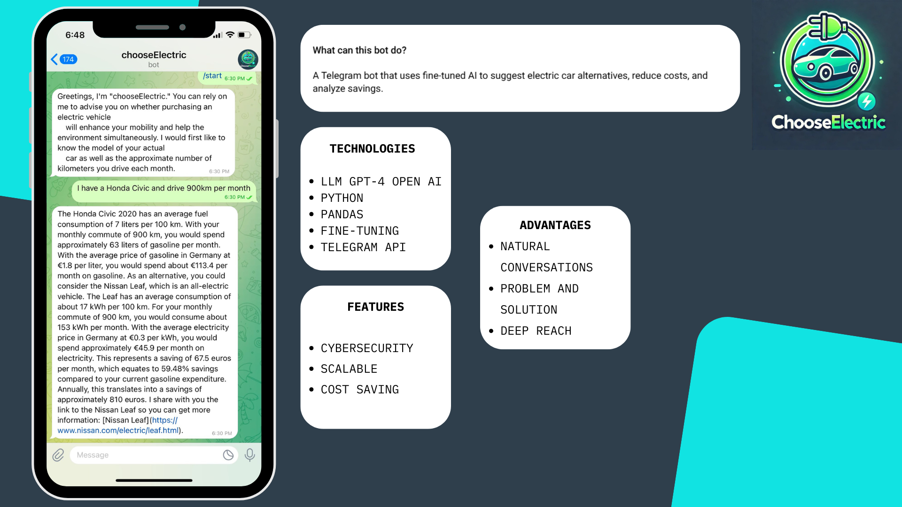

# ChooseElectric Bot

ChooseElectric is a Telegram bot designed to help users decide if switching to an electric vehicle is a viable option for them. Based on the information provided by the user, the bot utilizes the OpenAI API to analyze data about the user's current car model, monthly consumption, and other relevant factors to suggest electric alternatives. It also calculates potential savings in costs and emissions. The bot uses a fine-tuned language model to enable natural conversations and provide personalized recommendations.

The bot can be found on Telegram using the username: [@whyAnElectricCarBot](https://t.me/whyAnElectricCarBot).

Additionally, data analysis with the pandas library was used to evaluate the fine-tuning training process of the language model. This helped ensure the model's accuracy and reliability when interacting with users.

---

## Features

- Provides personalized electric vehicle recommendations.
- Calculates potential cost savings between fuel and electricity.
- Suggests specific electric vehicle models.
- Implements secure handling of user data and API keys.
- Validates and sanitizes user input to prevent malicious activity.
- Fine-tuned GPT model for enhanced accuracy in recommendations.

---

## Advantages of Fine-Tuning

Fine-tuning allows the model to be customized for specific use cases, improving its accuracy and relevance in particular domains. In this project, fine-tuning provided the following benefits:

- **Improved Contextual Understanding**: The model was trained on datasets specific to electric vehicles, enabling it to provide precise recommendations.
- **Enhanced Performance**: Fine-tuning reduced irrelevant or generic responses, ensuring a better user experience.
- **Cost Efficiency**: By fine-tuning a pre-trained model, the need for extensive data and computational resources was minimized compared to training a model from scratch.
- **Domain Expertise**: The bot delivers answers tailored to the context of electric vehicles, making it more reliable and useful.

---

## Technologies Used

This project leverages the following technologies:

- **Python**: Core programming language for the bot's logic and API integrations.
- **OpenAI GPT Model**: Used for generating personalized responses based on user input.
- **Telegram Bot API**: For seamless interaction with users via Telegram.
- **Python Libraries**:
  - `openai`: To communicate with the OpenAI API.
  - `requests`: For handling HTTP requests.
  - `python-dotenv`: For managing environment variables securely.
  - `pandas`: For data analysis during the fine-tuning process.
  - Additional libraries as listed in `requirements.txt`.

---

## Usage

Run the bot with:
```bash
python main_bot.py
```

Once the bot is running, you can interact with it via Telegram by sending messages to the bot's username.

**The bot can be found on Telegram using the username: [@whyAnElectricCarBot](https://t.me/whyAnElectricCarBot).**

---

## Example Conversation

**User**: I currently drive a Toyota Corolla 2018 and I commute 500km per month. Should I switch to an electric vehicle?

**Bot**: The Toyota Corolla 2018 has an average fuel consumption of 6 liters per 100 km. For your monthly commute of 500 km, you would spend approximately 30 liters of gasoline. At an average fuel cost of €1.8 per liter, this translates to €54 per month.

As an alternative, you could consider the Nissan Leaf, an all-electric vehicle. It consumes about 15 kWh per 100 km. For your monthly commute of 500 km, you would consume approximately 75 kWh of electricity. With an average electricity cost of €0.3 per kWh, this amounts to €22.50 per month.

Switching to an electric vehicle could save you €31.50 per month or €378 annually, while also contributing to a cleaner environment.

---

## Files in the Repository

- **`main_bot.py`**: Main script to run the Telegram bot.
- **`data_analisys.py`**: Script for analyzing data to ensure model accuracy and performance.
- **`data_preparation.py`**: Prepares data for training or validation, including cleaning and structuring.
- **`data_train.jsonl`**: Training data used for fine-tuning the GPT model.
- **`data_val.jsonl`**: Validation data to evaluate the model's performance and accuracy.
- **`.env`**: Stores sensitive API keys (not included in the repository for security).
- **`requirements.txt`**: List of dependencies required to run the project.

---

## Fine-Tuning and Data Validation

- **Fine-Tuned Model**: This project uses a fine-tuned version of OpenAI's GPT model to provide highly specific recommendations tailored to the context of electric vehicles.
- **Data Validation**: Validation datasets (`data_val.jsonl`) were used to measure model accuracy and avoid overfitting.
- **Data Analysis**: The `data_analisys.py` script analyzes training and validation data to ensure data consistency and relevance.

---

## Security Features

- **Input Sanitization**: All user inputs are sanitized to prevent malicious injection attacks.
- **Rate Limiting**: Limits the frequency of user messages to prevent abuse or overloading.
- **API Key Protection**: API keys are stored securely in a `.env` file and never exposed in the source code.
- **Error Handling**: Comprehensive error handling to ensure smooth operation and logging of issues.

---

## License

This project is licensed under the MIT License. See the `LICENSE` file for details.

---

## Contact

For any questions, feel free to contact: **your-email@example.com**.

